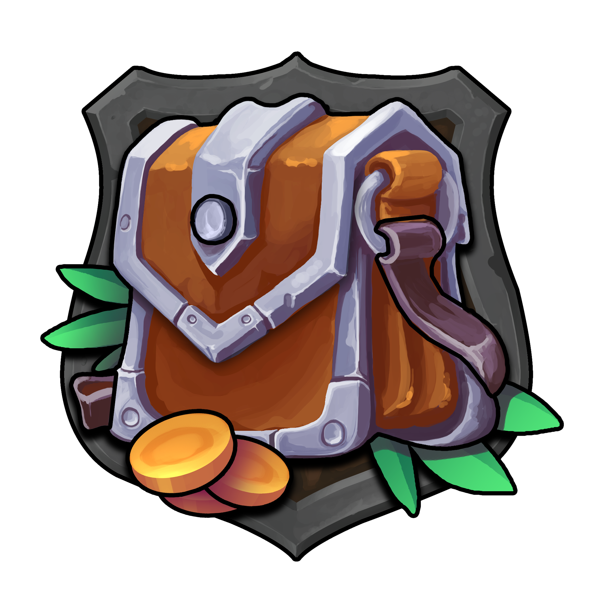

CodeWorks Tech Night
====================

  

Welcome to `Wizbang's Worldly Wonders` aka (*`www`*), Now let's walk through the foundational topics of web development. These topics are designed to help students learn the skills needed to get through the CodeWorks Fullstack Technical Challenge.

### Topics

- HTML
  - Structure
  - Semantic Tags
    - Header
    - Nav
    - Main
    - Section
    - Footer
  - Basic Tags
    - div
    - p
    - span, b, i 
    - img
    - button
    - ul, ol, li
- CSS
  - External Stylesheets
  - Classes
  - Flexbox
  - Box Model
  - Size and Positions
  - Color
  - Borders
  - Filter
  - Icon Library
  - Bootstrap offcanvas
  - Utility Classes
- JavaScript
  - Variables
  - DataTypes
  - Click Events
  - Iterations
  - DOM Manipulation drawing templates
  
[https://www.figma.com/file/2pParpeSUFpfe87XY8R7al/CodeWorks-Tech-Night?node-id=0%3A1](Prototype)
